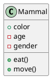
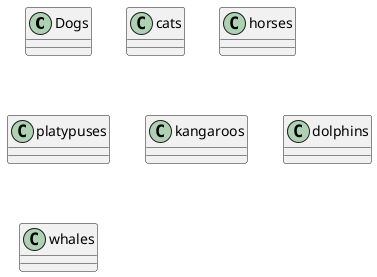
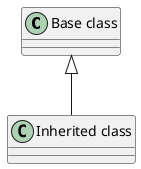
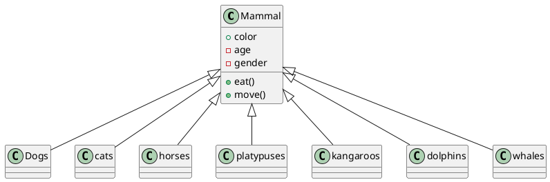

# การทดลอง วาดไดอะแกรมด้วย plantUML (2)

## 1. แผนภาพตามแนวคิด generalization abstraction

### 1.1 คลาสของสัตว์

#### 1.1.1 Mammals

- Dogs, cats, horses, duckbill platypuses, kangaroos, dolphins และ whales เป็นสัตว์เลี้ยงลูกด้วยนม
- ตัวอ่อนดื่มนมเป็นอาหาร และมีขนตามร่างกาย

#### วิเคราะห์คลาสหลัก Mammals 
Attributes 
- สีขน
- อายุ
- เพศ

Methods
 - กินอาหาร
 - เคลื่อนที่

####  คลาสย่อย

#### การแสดงความสัมพันธ์ generalization

ทำได้โดยการใช้เครื่องหมายลูกศรสามเหลี่ยม หรือเขียนเป็นสัญลักษณ์ด้วย code ดังตัวอย่างด้านล่างนี้

### ตัวอย่างระบบคลาสของ mammals

## แบบฝึกหัด 
ให้เขียนคลาสไดอะแกรมของหัวข้อต่อไปนี้ โดยใช้ plantuml

1. ให้นักศึกษาวาดไดอะแกรมของการ inheritance ของสัตว์ให้ครบทุกประเภท โดยเพิ่ม properties และ methods ได้ตามคำอธิบายหรือธรรมชาติของสัตว์ชนิดนั้นๆ 

    1.1  Birds เช่น เหยี่ยว ห่าน เป็ด ไก่ มีขน และเกิดจากไขที่มีเปลือกแข็ง ขนบนปีกและหาง จะทับซ้อนกันอยู่ ซึ่งทำให้โต้ลม และทำให้นกบินและร่อนลงได้

    1.2 Fish  เช่น ปลากัด ปลาทู ปลาแซลมอน เป็นสัตว์มีกระดูกสันหลัง อาศัยในน้ำ มี เหงือก (gills),  เกล็ด (scales)  และ ครีบ (fins)

    1.3 Reptiles (สัตว์เลื้อยคลาน)  เช่น จรเข้ งู
 กิ้งก่า เป็นสัตว์ที่มีเกล็ดบนผิวหนัง เป็นสัตว์เลือดเย็นและเกิดบนบก

    1.4 Amphibians (สัตว์ครึ่งบกครึ่งน้ำ) เช่น กบ เขียด อึ่งอ่าง เกิดในน้ำ เมื่อแรกเกิดจะหายใจด้วยเหงือกคล้ายปลา เมื่อโตขึ้นจะพัฒนาปอดขึ้นมาและอาศัยบนบกเป็นหลัก

    1.5 Arthropods เช่น กุ้ง ก้งกือ แมงมุม มด เป็นสัตว์ที่มีมากกว่า 4 ขา 

2. ให้วิเคราะห๋และเขียนคลาสไดอะแกรม แสดงการสืบทอดของยานพาหนะ ทางบก ทางน้ำ และ ทางอากาศ

3. ให้ยกตัวอย่างประเภทของที่อยู่อาศัย ให้คำจำกัดความและแสดงคลาสไดอะแกรม
!

## 2. [แผนภาพตามแนวคิด Association abstraction](Week04-lab-part-02.md)

