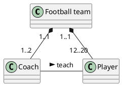
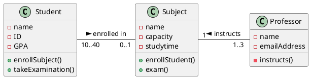
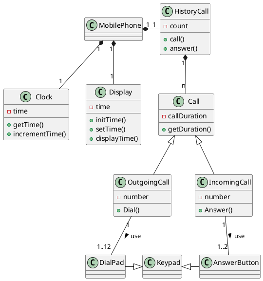

# การทดลอง วาดไดอะแกรมด้วย plantUML (2)
## การวาดไดอะแกรมที่มีองค์ประกอบมากขึ้น

ให้นักศึกษาพิจารณาวาด uml diagram ของ code ต่อไปนี้ในกระดาษ โดยยังไม่ต้องใช้ plantuml จากนั้นให้ไปวาดใน  plantuml แล้วเปรียบเทียบผลที่ได้ว่าตรงตามที่คิดหรือไม่

1. 

ตรงตามที่คิด

2. 

ตรงตามที่คิด
3. 

ตรงตามที่คิด

### จบการทดลองและแบบฝึกหัด
