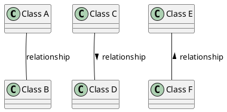
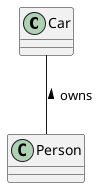
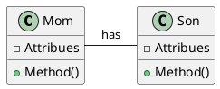
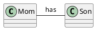
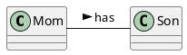
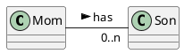
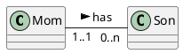
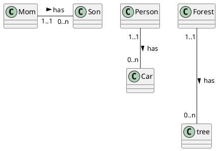

# การทดลอง วาดไดอะแกรมด้วย plantUML (2)

## 2. แผนภาพตามแนวคิด Association abstraction

Association abstraction เป็นการแสดงความสัมพันธ์ระหว่าง class ที่มีความสัมพันธ์แบบเกี่ยวพันกัน ไม่สามารถอธิบายโดย Abstraction แบบอื่น ๆ ได้
- ไม่ใช่ "Is a" แบบ Classification
- ไม่ใช่ "Is part of" แบบ Aggregation
- ไม่ใช่ "Is kind of" แบบ Generalization
- แต่เป็น "Is related to"  

### รูปแบบ

### ตัวอย่าง

1. คนเป็นเจ้าของรถยนต์

## Cardinality ใน Association Abstraction

“Cardinality”  คือตัวเลขที่ใช้แสดงจำนวนของสมาชิกที่สามารถมีได้ใน Class หนึ่งๆ ที่มีส่วนร่วมใน Association

### ตัวอย่าง 
แม่สามารถมีลูกได้ตั้งแต่ 0 คน ถึงกี่คนก็ได้ ในทางกลับกัน ลูก 1 คน สามารถมีแม่ได้เพียงคนเดียว

ขั้นตอนที่ 1 : เขียน class 2 class ที่มีความสัมพันธ์และลากเส้นตรงใส่ชื่อแสดงความสัมพันธ์

จะได้ผลลัพธ์ดังรูป

หรือจะละไว้ในกรณีที่ไม่ต้องการแสดงรายละเอียดภายในคลาสก็ได้ ดังตัวอย่าง

จะได้ผลลัพธ์ดังรูป

ขั้นตอนที่ 2 : เขียนลูกศรเพื่อแสดงทิศทางของการอ่านความสัมพันธ์ให้ถูกต้อง

จะได้ผลลัพธ์ดังรูป

ขั้นตอนที่ 3 : พิจารณา class ที่อยู่ติดกับหัวลูกศรว่ามีความสัมพันธ์กับ class แรกด้วย min-card และ max-card เป็นเท่าใด

จะได้ผลลัพธ์ดังรูป

ขั้นตอนที่ 4 : พิจารณา class ที่อยู่ติดกับหัวลูกศรว่ามีความสัมพันธ์กับ class แรกด้วย min-card และ max-card เป็นเท่าใด จนกระทั่งได้ภาพที่สมบูรณ์

จะได้ผลลัพธ์ดังรูป

 

### หมายเหตุ

เราสามารถควบคุมทิศทางการวาดคลาสไดอะแกรมได้โดยการเปลี่ยนเครื่องหมาย `-` เป็น `--` ดังตัวอย่าง

โดยจำนวนที่เพิ่มขึ้นของ `-` จะมีส่วนเพิ่มระยะห่างระหว่างคลาสด้วย 

จะได้ผลลัพธ์ดังรูป

##  แบบฝึกหัด

1. จงเขียนความสัมพันธ์ในโลกของความเป็นจริง ให้เป็น association diagram โดยเพิ่ม cardinality และ กำหนดทิศทางความสัมพันธ์ให้ถูกต้อง

   1.1 คนเป็นเจ้าของรถยนต์

   

   1.2 แม่มีลูก

   

   1.3 สามีรักภรรยา
   
   

   1.4 ดินสออยู่ในกระเป๋า
   
   

   1.5 นักการเมืองออกกฎหมาย
   
   

   1.6 ทหารใส่เครื่องแบบ
   
   

   1.7 ประธานบริษัทบริหารกิจการ
   
   

   1.8 กระดานดำอยู่ในห้องเรียน

## [การวาดไดอะแกรมที่มีองค์ประกอบมากขึ้น](./Week04-lab-part-03.md)

